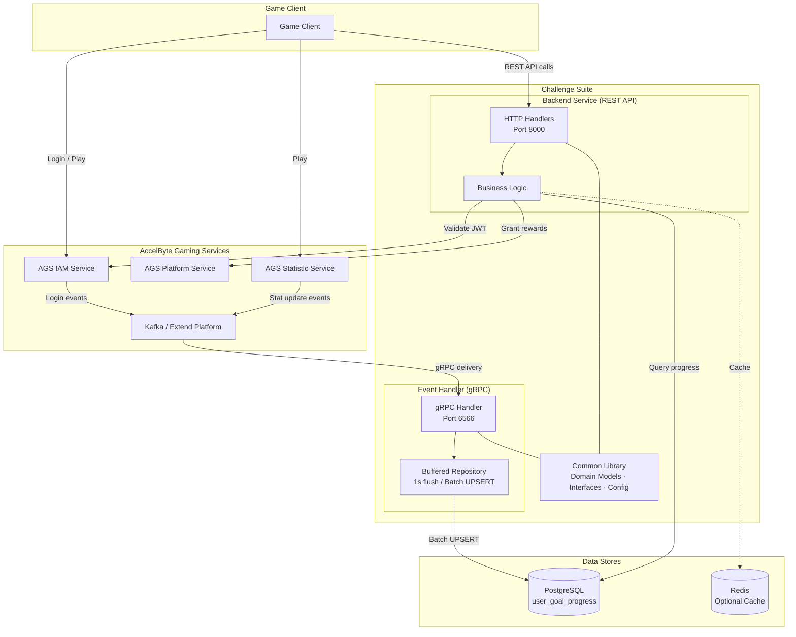
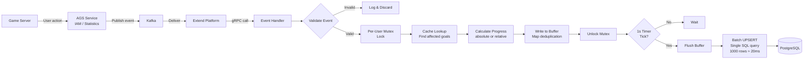
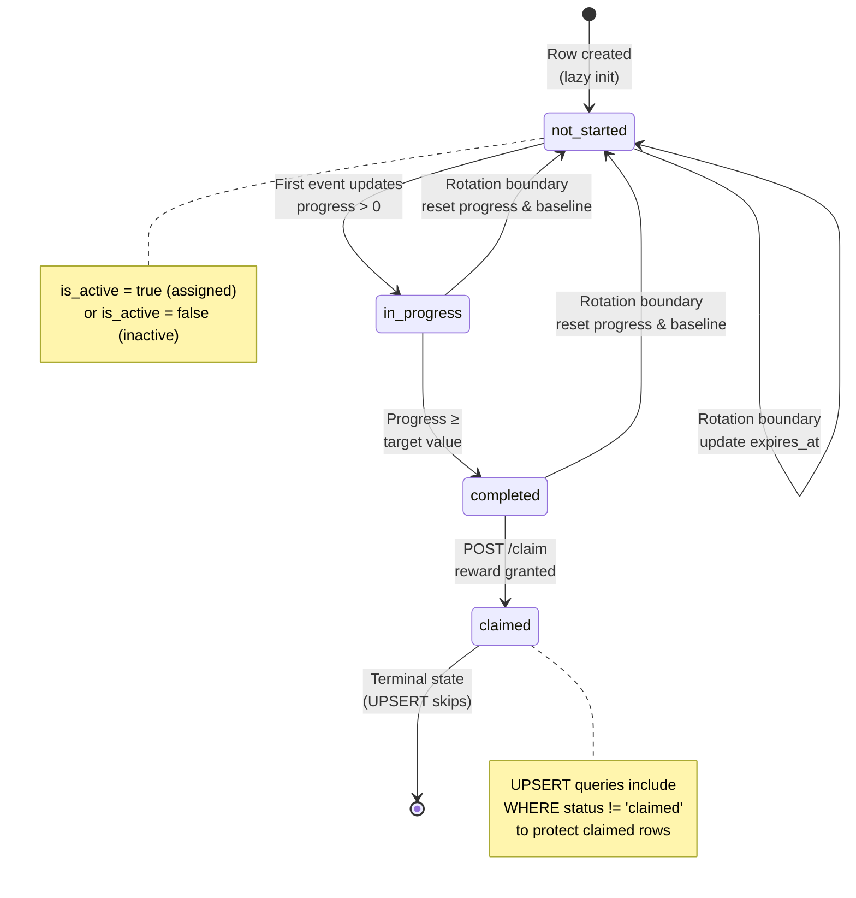
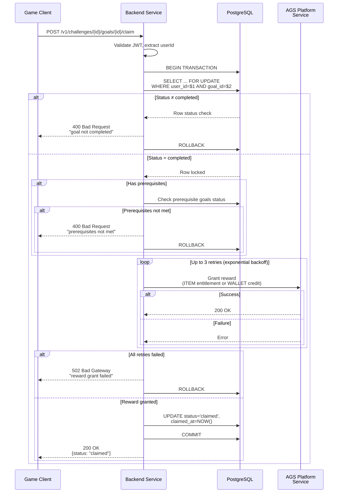
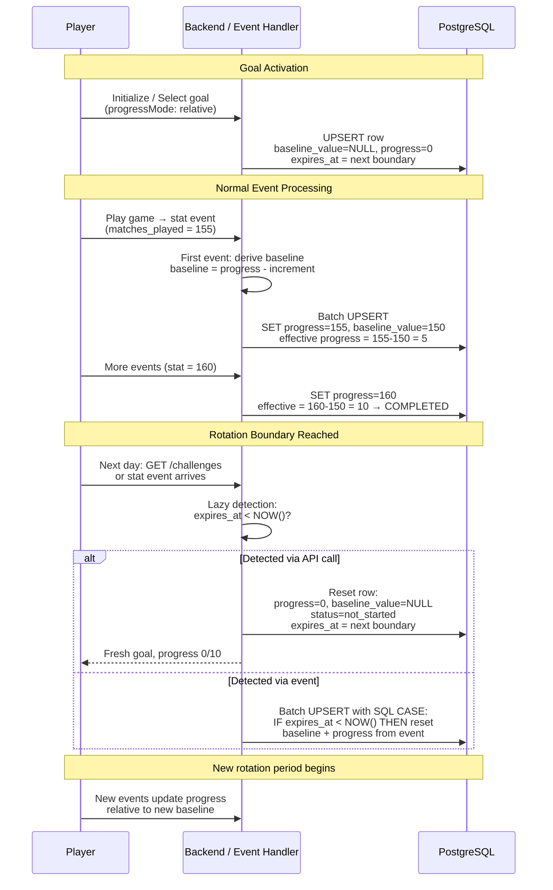
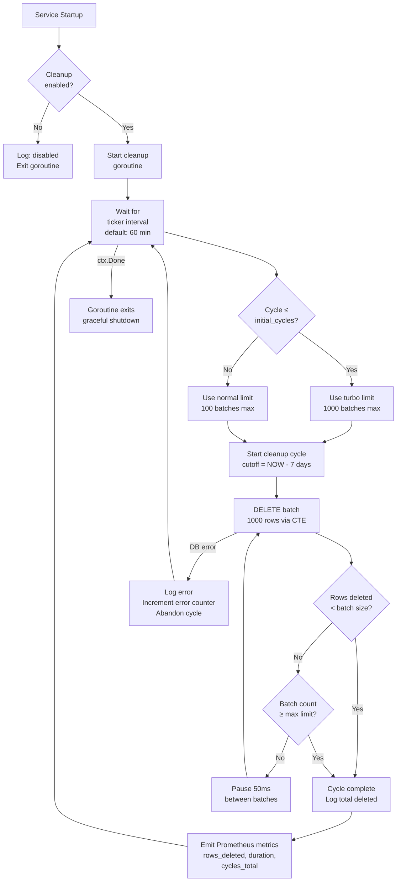
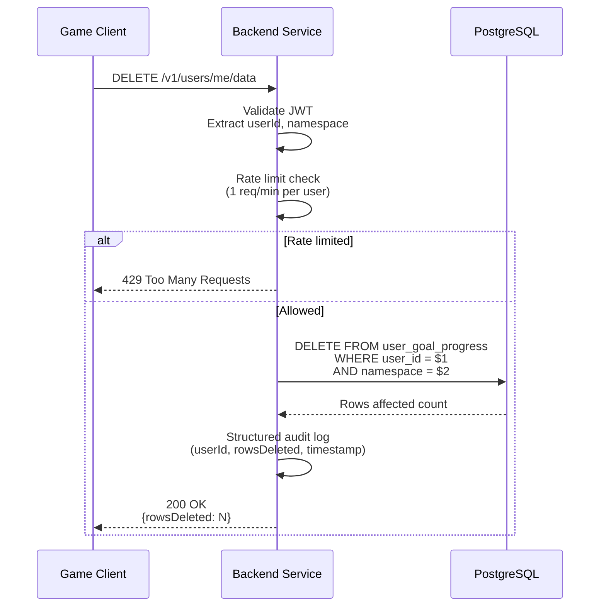

# Visual Flow Diagrams

**Interactive Mermaid diagrams** for the AccelByte Extend Challenge Service.
These render automatically on GitHub and in any Mermaid-compatible viewer ([mermaid.live](https://mermaid.live)).

---

## Table of Contents

1. [System Architecture Overview](#1-system-architecture-overview)
2. [Event Processing Pipeline](#2-event-processing-pipeline)
3. [Goal Status State Machine](#3-goal-status-state-machine)
4. [Reward Claiming Flow](#4-reward-claiming-flow)
5. [Goal Selection Patterns](#5-goal-selection-patterns)
6. [Time-Based Rotation Lifecycle](#6-time-based-rotation-lifecycle)
7. [Expired Row Cleanup](#7-expired-row-cleanup)
8. [GDPR User Data Deletion](#8-gdpr-user-data-deletion)

---

## 1. System Architecture Overview

Two Extend microservices share a common library and integrate with AGS platform services.



---

## 2. Event Processing Pipeline

The core performance innovation: events are buffered and flushed as batch UPSERTs, achieving a **1,000,000x DB query reduction**.



**Key properties:**
- Per-user mutex serializes events for one user; different users process in parallel
- Map-based buffer keeps only the latest progress per `(user_id, goal_id)` pair
- 1,000 buffered updates = 1 database query (not 1,000 queries)

---

## 3. Goal Status State Machine

Every goal row follows this state machine. Rotation adds reset paths back to `not_started`.



---

## 4. Reward Claiming Flow

Row-level locking (`SELECT ... FOR UPDATE`) prevents double claims. Failed reward grants are retried 3 times with exponential backoff.



---

## 5. Goal Selection Patterns

Three patterns for controlling which goals a player works on. Game developers choose based on their UX needs.

```mermaid
flowchart TD
    subgraph individual ["Individual Selection (M3)"]
        I1[Client calls<br/>PUT /goals/{id}/active] --> I2{Goal exists<br/>in config?}
        I2 -->|No| I3[404 Not Found]
        I2 -->|Yes| I4[UPSERT row<br/>is_active = true]
        I4 --> I5[Goal now tracks<br/>events]
    end

    subgraph batch ["Batch Selection (M4)"]
        B1[Client calls<br/>POST /goals/batch-select<br/>goalIds: list] --> B2{All IDs valid?}
        B2 -->|No| B3[400 Bad Request<br/>invalid goal IDs]
        B2 -->|Yes| B4[BatchUpsertGoalActive<br/>single SQL for all goals]
        B4 --> B5[All goals now<br/>active]
    end

    subgraph random ["Random Selection (M4)"]
        R1[Client calls<br/>POST /goals/random-select<br/>count: N] --> R2[Filter available<br/>goals from config]
        R2 --> R3[Exclude already<br/>active goals]
        R3 --> R4[Shuffle &<br/>pick N goals]
        R4 --> R5[BatchUpsertGoalActive<br/>single SQL]
        R5 --> R6[N random goals<br/>now active]
    end
```

---

## 6. Time-Based Rotation Lifecycle

Rotation uses **baseline-relative tracking** so cumulative stats (e.g., `matches_played: 150 → 160`) can power daily goals. Detection is **lazy** — triggered only when the player interacts.



**Rotation types:** `daily` (midnight UTC), `weekly` (Monday midnight), `monthly` (1st of month).

---

## 7. Expired Row Cleanup

A background goroutine in the backend service prevents unbounded table growth from rotating goals. **Turbo mode** clears backlogs on startup.



---

## 8. GDPR User Data Deletion

Per-user rate limiting (1 request/minute) prevents abuse. The delete is partition-optimal since `user_id` is the partition key.



---

## Rendering These Diagrams

- **GitHub**: Renders automatically in markdown preview
- **VS Code**: Install [Markdown Preview Mermaid Support](https://marketplace.visualstudio.com/items?itemName=bierner.markdown-mermaid)
- **Online**: Paste into [mermaid.live](https://mermaid.live)

---

*See [INDEX.md](INDEX.md) for the full documentation index.*
